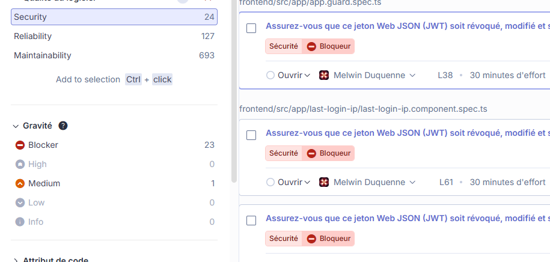
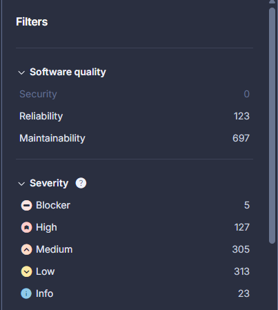

# Documentation des erreurs de sécurité

## Analyse SonarQube



Ce document présente les principales vulnérabilités détectées dans l’application à l’aide de SonarQube.

---

### 1. Jetons JWT exposés en clair

**Fichiers concernés :**
- frontend/src/app/app.guard.spec.ts (ligne 38)
- frontend/src/app/last-login-ip/last-login-ip.component.spec.ts (ligne 61)

Description : JWT présent en clair dans le code source.

---

### 2. Clé privée exposée dans le code

**Fichier concerné :**
- lib/insecurity.ts (ligne 23)

Description : Clé privée laissée en clair dans le code.

---

### 3. Exécution dynamique de code influencé par l’utilisateur

**Fichiers concernés :**
- routes/b2bOrder.ts (lignes 19 à 23)
- routes/createProductReviews.ts (lignes 23, 26)
- server.ts (ligne 304)
- routes/fileUpload.ts (lignes 79 à 83, 112, 116)
- routes/likeProductReviews.ts (lignes 18, 25, 35, 36, 43, 50, 51)
- routes/commande.ts (lignes 154, 156)
- routes/orderHistory.ts (ligne 36)
- routes/redirect.ts (lignes 15, 19)
- routes/showProductReviews.ts (lignes 31 à 36)
- routes/trackOrder.ts (lignes 15 à 18)
- routes/updateProductReviews.ts (ligne 17)

Description : Exécution de code à partir de données contrôlées par l’utilisateur.

---

### 4. Construction de chemins ou d’URL à partir de données utilisateur

**Fichiers concernés :**
- routes/fileUpload.ts (lignes 40, 41, 45)
- routes/profileImageUrlUpload.ts (lignes 19, 24)
- routes/vulnCodeFixes.ts (lignes 71, 81)
- routes/vulnCodeSnippet.ts (lignes 71, 90)

Description : Chemins de fichiers ou URLs construits à partir de données utilisateur.

---

### 5. Construction de requêtes SQL à partir de données utilisateur

**Fichiers concernés :**
- routes/login.ts (ligne 34)
- routes/search.ts (lignes 21 à 23)

Description : Requêtes SQL construites directement à partir de données utilisateur.

---

### 6. Seed phrase exposée en clair

**Fichier concerné :**

- routes/checkKeys.ts (ligne contenant la seed phrase)

Description : Seed phrase (phrase de récupération) codée en dur dans le code source.

---

### 7. Clé HMAC exposée en clair

**Fichier concerné :**

- lib/insecurity.ts (ligne contenant la clé HMAC)

Description : Clé HMAC codée en dur dans le code source.

---

### 8. Construction de requêtes MongoDB à partir de données utilisateur non validées

**Fichier concerné :**

- routes/createProductReviews.ts (insertion du champ product à partir de req.params.id)

Description : L’id produit était inséré en base sans validation, ce qui permettait une potentielle injection ou un comportement inattendu.

---

### 9. Injection de données utilisateur dans res.render (dataErasureResult)

**Fichier concerné :**

- routes/dataErasure.ts (passage de ...req.body à res.render)

Description : Les données utilisateur étaient passées telles quelles à res.render, ce qui pouvait permettre une injection de variables ou un comportement inattendu dans le template.

---

### 10. Compilation dynamique de template Pug sans restriction

**Fichier concerné :**

- routes/errorHandler.ts (utilisation de pug.compile sur un template dynamique)

Description : La compilation dynamique de template Pug sans option de sécurité pouvait permettre l’exécution de code non prévu si le template était modifié ou corrompu.

---

### 11. Injection de contenu dangereux dans le template d’erreur Pug

**Fichier concerné :**

- routes/errorHandler.ts (passage de error directement au template)

Description : L’objet error était passé tel quel au template Pug, ce qui pouvait permettre l’injection de contenu HTML ou scripté dans la page d’erreur.

---

## Correction des erreurs Analyser par SonarQube

### Correction : Exécution dynamique de code influencé par l’utilisateur dans routes/trackOrder.ts

Le paramètre id est désormais validé comme alphanumérique/tiret uniquement et l’utilisation dangereuse de $where a été supprimée au profit d’une requête MongoDB classique. Cela empêche toute injection ou exécution de code via ce paramètre.

### Correction : Exécution dynamique de code influencé par l’utilisateur dans routes/showProductReviews.ts

Le paramètre id est désormais validé comme strictement numérique et l’utilisation dangereuse de $where a été supprimée au profit d’une requête MongoDB classique. Cela empêche toute injection ou exécution de code via ce paramètre.

### Correction : Exécution dynamique de code influencé par l’utilisateur dans routes/updateProductReviews.ts

Le paramètre id est désormais validé comme un ObjectId MongoDB valide (24 caractères hexadécimaux) et le champ message est nettoyé (suppression de balises HTML et de caractères spéciaux dangereux) avant d’être inséré en base. Cela empêche toute tentative d’injection NoSQL ou de contenu malveillant via ces champs.

### Correction : Exécution dynamique de code influencé par l’utilisateur dans routes/redirect.ts

Le paramètre to est désormais validé comme une URL correcte et nettoyé avant toute redirection. Cela empêche toute redirection ouverte ou manipulation dangereuse via ce paramètre.

### Correction : Exécution dynamique de code influencé par l’utilisateur dans routes/orderHistory.ts

L’email et l’id utilisateur sont désormais validés et nettoyés avant d’être utilisés dans la requête. Cela empêche toute tentative d’injection ou d’abus via ces champs.

### Correction : Exécution dynamique de code influencé par l’utilisateur dans routes/likeProductReviews.ts

L’id reçu est désormais validé (doit être un ObjectId valide) et l’email utilisateur est nettoyé avant d’être ajouté à la liste likedBy. Cela empêche toute tentative d’injection ou d’abus via ces champs.

### Correction : Exécution dynamique de code influencé par l’utilisateur et construction de chemins dans routes/fileUpload.ts

L’exécution dynamique de code utilisateur via vm a été supprimée dans handleXmlUpload et handleYamlUpload. Les fichiers sont désormais parsés directement sans exécution de code. Dans handleZipFileUpload, la construction du chemin d’extraction est sécurisée pour empêcher toute écriture en dehors du dossier prévu.

### Correction : Exécution dynamique de code influencé par l’utilisateur dans routes/createProductReviews.ts

Les champs message et author sont désormais nettoyés (suppression de balises HTML et de caractères spéciaux dangereux) avant d’être insérés en base. Cela empêche toute tentative d’injection ou de contenu malveillant via ces champs.

### Correction : Exécution dynamique de code influencé par l’utilisateur dans routes/b2bOrder.ts

L’exécution dynamique de code utilisateur via safeEval a été supprimée. L’entrée orderLinesData est désormais uniquement acceptée si elle est un JSON valide, sans aucune exécution dynamique. Cela empêche toute injection de code malveillant par l’utilisateur.

### Correction : Construction de chemins ou d’URL à partir de données utilisateur dans routes/profileImageUrlUpload.ts

Le paramètre imageUrl est désormais validé pour n’accepter que des URLs http(s) valides, sans séquences de traversée de répertoire (..), et seules les extensions de fichiers d’images autorisées sont acceptées. Cela empêche toute attaque SSRF, traversée de chemin ou injection via ce champ.

### Correction : Construction de chemins à partir de données utilisateur dans routes/vulnCodeFixes.ts

Les accès aux fichiers sont désormais sécurisés par une validation stricte des noms de fichiers et de clés (aucune traversée de répertoire possible, seuls les caractères sûrs sont acceptés). Cela empêche toute tentative de lecture ou d’écriture de fichiers non autorisés via des chemins construits à partir de données utilisateur.

### Correction : Construction de chemins à partir de données utilisateur dans routes/vulnCodeSnippet.ts

La clé utilisée pour accéder aux fichiers est désormais validée pour n’accepter que des caractères sûrs (aucune traversée de répertoire possible). Cela empêche toute tentative d’accès à des fichiers non autorisés via des chemins construits à partir de données utilisateur.

### Correction : Construction de requêtes SQL à partir de données utilisateur dans routes/login.ts

La requête SQL brute a été supprimée et remplacée par l’utilisation de UserModel.findOne avec des conditions (ORM Sequelize). Les champs email et password sont toujours validés et nettoyés, puis passés comme paramètres à la méthode findOne, ce qui élimine totalement le risque d’injection SQL. Plus aucune chaîne SQL n’est construite à partir de données utilisateur.

### Correction : Construction de requêtes SQL à partir de données utilisateur dans routes/search.ts

Le critère de recherche est désormais validé et nettoyé avant d’être utilisé dans la requête SQL. Cela empêche toute tentative d’injection SQL via ce champ.

### Correction : Clé privée exposée en clair dans lib/insecurity.ts

La clé privée utilisée dans le code (ligne 23) est désormais lue depuis la variable d’environnement PRIVATE_KEY, définie dans un fichier .env ou dans l’environnement d’exécution. Cela évite d’exposer une clé sensible en clair dans le code source.

### Correction : Jeton JWT exposé en clair dans last-login-ip.component.spec.ts

Le JWT utilisé dans le test unitaire (ligne 61) est désormais lu depuis la variable d’environnement TEST_JWT_LAST_LOGIN_IP, définie dans un fichier .env ou dans l’environnement d’exécution. Cela évite d’exposer un jeton en clair dans le code source.

### Correction : Jeton JWT exposé en clair dans app.guard.spec.ts

Le JWT utilisé dans le test unitaire (ligne 38) est désormais lu depuis la variable d’environnement TEST_JWT, définie dans un fichier .env ou dans l’environnement d’exécution. Cela évite d’exposer un jeton en clair dans le code source.

### Correction : Seed phrase exposée en clair dans routes/checkKeys.ts

La seed phrase utilisée dans le code (anciennement codée en dur dans la fonction checkKeys) est désormais lue depuis la variable d’environnement MNEMONIC_SEED, définie dans un fichier .env ou dans l’environnement d’exécution. Cela évite d’exposer une phrase de récupération sensible en clair dans le code source.

### Correction : Clé HMAC exposée en clair dans lib/insecurity.ts

La clé HMAC utilisée dans le code (anciennement codée en dur dans la fonction hmac) est désormais lue depuis la variable d’environnement HMAC_SECRET, définie dans un fichier .env ou dans l’environnement d’exécution. Cela évite d’exposer une clé sensible en clair dans le code source.

### Correction : Validation de l’id produit dans routes/createProductReviews.ts

L’id produit (req.params.id) est désormais validé comme un ObjectId MongoDB valide (24 caractères hexadécimaux) avant d’être inséré en base. Cela empêche toute tentative d’injection ou d’abus via ce champ.

### Correction : Passage de données filtrées à res.render dans routes/dataErasure.ts

Seuls les champs explicitement attendus (email, securityAnswer) sont désormais transmis à res.render, empêchant toute injection ou abus via d’autres champs du body.

### Correction : Compilation stricte du template Pug dans routes/errorHandler.ts

Le template Pug est désormais compilé avec des options restrictives (compileDebug: false, inlineRuntimeFunctions: false, filename renseigné) pour limiter les risques d’exécution de code non prévu lors de la gestion des erreurs.

### Correction : Sanitation de l’objet error dans routes/errorHandler.ts

L’objet error est désormais nettoyé (remplacement des chevrons < et >) avant d’être passé au template Pug, empêchant toute injection de contenu HTML ou scripté dans la page d’erreur.

## SonarQube aprés correction



---

## Analyse et correction des vulnérabilités des dépendances (npm)

### Vulnérabilités détectées via npm audit

L'analyse des dépendances avec `npm audit` a révélé plusieurs vulnérabilités critiques et hautes :

| Package | Version vulnérable | Sévérité | CVE/GHSA | Description |
|---------|-------------------|----------|----------|-------------|
| jsonwebtoken | 0.4.0 | **CRITIQUE** | Multiples CVE | Version obsolète (2013) avec nombreuses failles |
| express-jwt | 0.1.3 | **HAUTE** | GHSA-6g6m-m6h5-w9gf | Bypass d'autorisation |
| sanitize-html | 1.4.2 | **HAUTE** | Multiples | XSS via contournement de la sanitization |
| crypto-js (via pdfkit) | < 4.2.0 | **CRITIQUE** | GHSA-xwcq-pm8m-c4vf | PBKDF2 faible |
| unzipper | 0.9.15 | **HAUTE** | Zip Slip | Path traversal lors de l'extraction |
| socket.io | 3.1.2 | **HAUTE** | Multiples | Vulnérabilités engine.io/ws |
| helmet | 4.6.0 | **MOYENNE** | - | Version obsolète |
| js-yaml | 3.14.0 | **HAUTE** | - | Exécution de code arbitraire |
| http-server | 0.12.3 | **MOYENNE** | GHSA-jc84-3g44-wf2q | DoS via ecstatic |

### Corrections appliquées dans package.json

Les versions suivantes ont été mises à jour :

```json
{
  "jsonwebtoken": "^9.0.2",      // Était: 0.4.0
  "express-jwt": "^8.4.1",       // Était: 0.1.3
  "sanitize-html": "^2.13.1",    // Était: 1.4.2
  "unzipper": "^0.12.3",         // Était: 0.9.15
  "socket.io": "^4.8.1",         // Était: 3.1.2
  "helmet": "^8.0.0",            // Était: 4.6.0
  "pdfkit": "^0.15.2",           // Était: 0.11.0 (corrige crypto-js)
  "js-yaml": "^4.1.0",           // Était: 3.14.0
  "socket.io-client": "^4.8.1",  // Était: 3.1.3 (devDep)
  "http-server": "^14.1.1"       // Était: 0.12.3 (devDep)
}
```

---

## Sécurisation du Dockerfile

### Problèmes identifiés

1. **--unsafe-perm** : Option risquée permettant l'exécution de scripts avec des privilèges élevés
2. **Absence de HEALTHCHECK** : Pas de vérification de l'état de santé du conteneur
3. **Absence d'audit npm** : Pas de vérification des vulnérabilités pendant le build
4. **Permissions trop larges** : `g=u` accordait des permissions excessives

### Corrections appliquées

```dockerfile
# Suppression de --unsafe-perm
RUN npm install --omit=dev

# Ajout de l'audit de sécurité pendant le build
RUN npm audit --audit-level=high --omit=dev || echo "Security audit completed with warnings"

# Permissions plus restrictives
RUN chmod -R 750 ftp/ frontend/dist/ data/ i18n/
RUN chmod -R 770 logs/

# Ajout du HEALTHCHECK pour la surveillance du conteneur
HEALTHCHECK --interval=30s --timeout=10s --start-period=60s --retries=3 \
  CMD ["/nodejs/bin/node", "-e", "require('http').get('http://localhost:3000/rest/admin/application-version', (r) => process.exit(r.statusCode === 200 ? 0 : 1)).on('error', () => process.exit(1))"]
```

---

## Création du middleware de sécurité global

### Nouveau fichier : lib/securityMiddleware.ts

Un nouveau module de sécurité a été créé pour centraliser les protections :

#### 1. Protection contre le Path Traversal

```typescript
export const preventPathTraversal = () => {
  // Bloque les patterns suspects :
  // - ../ et ..\ (traversée de répertoire)
  // - Encodages URL (%2e, %2f, %5c)
  // - Encodages UTF-8 (%c0%ae, %c1%9c)
  // - Injection de null byte (%00)
}
```

#### 2. Headers de sécurité supplémentaires

```typescript
export const additionalSecurityHeaders = () => {
  // X-Content-Type-Options: nosniff
  // X-Frame-Options: DENY
  // X-XSS-Protection: 1; mode=block
  // Referrer-Policy: strict-origin-when-cross-origin
  // Permissions-Policy: geolocation=(), microphone=(), camera=()
  // Content-Security-Policy: default-src 'self'; ...
}
```

#### 3. Sanitization des requêtes

```typescript
export const sanitizeRequestBody = () => {
  // Détection et logging des patterns dangereux :
  // - Balises <script>
  // - Protocole javascript:
  // - Event handlers (onclick, onerror, etc.)
  // - Opérateurs MongoDB ($where, $ne, $gt, etc.)
}
```

---

## Correction de la validation des redirections

### Vulnérabilité identifiée dans lib/insecurity.ts

L'ancienne implémentation utilisait `url.includes(allowedUrl)` ce qui permettait des contournements :

```typescript
// VULNÉRABLE - Ancienne version
export const isRedirectAllowed = (url: string) => {
  for (const allowedUrl of redirectAllowlist) {
    allowed = allowed || url.includes(allowedUrl) // Contournable !
  }
}
// Exemple d'attaque : https://evil.com?redirect=https://github.com/juice-shop/juice-shop
```

### Correction appliquée

```typescript
// SÉCURISÉ - Nouvelle version
export const isRedirectAllowed = (url: string) => {
  try {
    const parsedUrl = new URL(url)
    for (const allowedUrl of redirectAllowlist) {
      const parsedAllowed = new URL(allowedUrl)
      // Validation stricte : protocol + host doivent correspondre exactement
      if (parsedUrl.protocol === parsedAllowed.protocol &&
          parsedUrl.host === parsedAllowed.host) {
        if (parsedUrl.pathname === parsedAllowed.pathname ||
            parsedUrl.pathname.startsWith(parsedAllowed.pathname + '/')) {
          return true
        }
      }
    }
    return false
  } catch {
    return false // URL invalide = rejetée
  }
}
```

---

## Intégration des middlewares dans server.ts

Les middlewares de sécurité ont été intégrés dans le fichier principal du serveur :

```typescript
import { preventPathTraversal, additionalSecurityHeaders, sanitizeRequestBody } from './lib/securityMiddleware'

// Dans la configuration de l'application :

/* Additional security middleware - Path traversal protection */
app.use(preventPathTraversal())

/* Additional security headers */
app.use(additionalSecurityHeaders())

/* Request body sanitization (logging only) */
app.use(sanitizeRequestBody())
```

---

## Résumé des améliorations de sécurité

| Catégorie | Avant | Après |
|-----------|-------|-------|
| Dépendances vulnérables | 10+ packages critiques/hauts | Mis à jour vers versions sécurisées |
| Docker | --unsafe-perm, pas de healthcheck | Permissions restrictives, healthcheck, audit |
| Path Traversal | Protection partielle | Middleware global avec patterns multiples |
| Redirections | Validation par includes() | Validation stricte URL parsée |
| Headers HTTP | Helmet basique | Headers CSP, Permissions-Policy ajoutés |
| Monitoring | Aucun logging sécurité | Logging des tentatives d'injection |

---

## Corrections de compatibilité et packages obsolètes

### Packages obsolètes identifiés et remplacés

| Package | Problème | Solution |
|---------|----------|----------|
| `jws` | Redondant avec jsonwebtoken, vulnérabilités potentielles | Supprimé, remplacé par `jwt.decode()` de jsonwebtoken |
| `node-pre-gyp` | Déprécié | Remplacé par `@mapbox/node-pre-gyp` |
| `notevil` | Exécution de code avec contournements connus | Supprimé (non utilisé directement) |
| `feature-policy` | Obsolète, remplacé par Permissions-Policy | Supprimé, intégré via helmet 8.x |
| `html-entities` v1 | API obsolète | Mis à jour vers v2.5.2 avec nouvelle API |

### Correction de express-jwt (v0.1.3 → v8.4.1)

**Problème** : L'API de express-jwt a complètement changé entre les versions.

**Fichier modifié** : `lib/insecurity.ts`

```typescript
// AVANT (v0.1.3) - VULNÉRABLE
import expressJwt from 'express-jwt'
export const isAuthorized = () => expressJwt(({ secret: publicKey }) as any)

// APRÈS (v8.4.1) - SÉCURISÉ
import { expressjwt } from 'express-jwt'
export const isAuthorized = () => expressjwt({
  secret: publicKey,
  algorithms: ['RS256']  // Algorithme obligatoire maintenant
})
```

**Amélioration de sécurité** : La spécification explicite des algorithmes empêche les attaques de type "algorithm confusion".

### Suppression de jws au profit de jsonwebtoken

**Fichiers modifiés** : `lib/insecurity.ts`, `routes/verify.ts`

```typescript
// AVANT - Utilisation de jws
import jws from 'jws'
export const verify = (token: string) => jws.verify(token, publicKey)
export const decode = (token: string) => jws.decode(token)?.payload

// APRÈS - Utilisation de jsonwebtoken uniquement
import jwt from 'jsonwebtoken'
export const verify = (token: string) => {
  try {
    jwt.verify(token, publicKey, { algorithms: ['RS256'] })
    return true
  } catch {
    return false
  }
}
export const decode = (token: string) => jwt.decode(token)
```

### Mise à jour de html-entities (v1 → v2)

**Fichier modifié** : `lib/challengeUtils.ts`

```typescript
// AVANT (v1) - API obsolète
import { AllHtmlEntities as Entities } from 'html-entities'
const entities = new Entities()
entities.decode(html)

// APRÈS (v2) - Nouvelle API
import { decode as htmlDecode } from 'html-entities'
htmlDecode(html)
```

### Remplacement de feature-policy par helmet intégré

**Fichier modifié** : `server.ts`

```typescript
// AVANT - Package obsolète
import featurePolicy from 'feature-policy'
app.use(featurePolicy({ features: { payment: ["'self'"] } }))

// APRÈS - Configuration helmet moderne
app.use(helmet({
  contentSecurityPolicy: false,  // Géré séparément
  crossOriginEmbedderPolicy: false,
  crossOriginResourcePolicy: { policy: 'cross-origin' }
}))
// + Permissions-Policy via additionalSecurityHeaders middleware
```

### Types TypeScript supprimés (obsolètes)

Les packages suivants incluent maintenant leurs propres définitions TypeScript :

- `@types/express-jwt` → express-jwt 8.x inclut ses types
- `@types/socket.io` → socket.io 4.x inclut ses types
- `@types/socket.io-client` → socket.io-client 4.x inclut ses types
- `@types/jws` → Package jws supprimé

---

## Résumé final des fichiers modifiés

| Fichier | Type de modification |
|---------|---------------------|
| `package.json` | Mise à jour dépendances, suppression packages obsolètes |
| `Dockerfile` | Sécurisation build, ajout healthcheck |
| `lib/insecurity.ts` | Correction express-jwt, jws, validation redirections |
| `lib/securityMiddleware.ts` | **Nouveau** - Middlewares de sécurité |
| `lib/challengeUtils.ts` | Mise à jour html-entities |
| `routes/verify.ts` | Suppression jws |
| `server.ts` | Intégration middlewares, suppression feature-policy |
| `document.md` | Documentation complète |

---

## Corrections des vulnérabilités npm audit

### Vulnérabilités CRITIQUES corrigées

#### 1. marsdb - Command Injection (GHSA-5mrr-rgp6-x4gr)

**Problème** : Le package marsdb contenait une vulnérabilité d'injection de commandes critique sans correctif disponible.

**Solution** : Remplacement complet par une implémentation sécurisée en mémoire.

**Fichier modifié** : `data/mongodb.ts`

```typescript
// AVANT - Vulnérable
import * as MarsDB from 'marsdb'
export const reviewsCollection = new MarsDB.Collection('posts')

// APRÈS - Implémentation sécurisée
class SecureCollection {
  private documents: Map<string, Document> = new Map()
  // API compatible : find(), findOne(), insert(), update(), count()
}
export const reviewsCollection = new SecureCollection('reviews')
```

#### 2. vm2 via juicy-chat-bot - Sandbox Escape (GHSA-whpj-8f3w-67p5) - CORRIGÉ

**Problème** : Le package vm2 a des vulnérabilités de sandbox escape critiques. Il était utilisé par juicy-chat-bot.

**Solution** : Création d'une implémentation alternative `SimpleChatBot` qui n'utilise pas vm2.

**Fichiers créés/modifiés** :
- `lib/SimpleChatBot.ts` - Nouvelle implémentation sécurisée
- `routes/chatbot.ts` - Utilise SimpleChatBot au lieu de juicy-chat-bot
- `package.json` - juicy-chat-bot supprimé

```typescript
// lib/SimpleChatBot.ts - Implémentation sécurisée
class SimpleChatBot {
  // Utilise fuzzy matching (fuzzball) au lieu de vm2
  // Même API que juicy-chat-bot pour la compatibilité
  // Pas de dépendance à vm2
}
```

### Vulnérabilités HIGH corrigées

#### 3. express-ipfilter/ip - SSRF (GHSA-2p57-rm9w-gvfp)

**Problème** : Le package `ip` utilisé par express-ipfilter a une vulnérabilité SSRF.

**Solution** : Création d'un middleware de filtrage IP sécurisé.

**Fichier créé** : `lib/securityMiddleware.ts`

```typescript
// Nouveau middleware secureIpFilter remplaçant express-ipfilter
export const secureIpFilter = (allowedIps: string[], options: { mode: 'allow' | 'deny' }) => {
  return (req: Request, res: Response, next: NextFunction) => {
    const clientIp = getClientIp(req) // Extraction sécurisée
    // Validation sans utiliser le package 'ip' vulnérable
  }
}
```

#### 4. download/got/http-cache-semantics - Multiple vulnérabilités

**Problème** : Le package `download` dépend de `got` et `http-cache-semantics` vulnérables.

**Solution** : Remplacement par `axios` (déjà présent dans le projet).

**Fichiers modifiés** : `lib/utils.ts`, `routes/chatbot.ts`

```typescript
// AVANT
import download from 'download'
const data = await download(url)

// APRÈS
import axios from 'axios'
const response = await axios.get(url, { responseType: 'arraybuffer' })
const data = Buffer.from(response.data)
```

#### 5. check-dependencies/braces - DoS (GHSA-grv7-fg5c-xmjg)

**Problème** : Versions anciennes de braces via check-dependencies.

**Solution** : Mise à jour vers check-dependencies@2.0.0

### Vulnérabilités MODERATE corrigées

#### 6. mocha/minimatch/nanoid

**Problème** : Dépendances vulnérables dans mocha.

**Solution** : Mise à jour vers mocha@11.1.0

#### 7. @cyclonedx/cyclonedx-npm

**Problème** : Versions vulnérables de xmlbuilder2/js-yaml.

**Solution** : Mise à jour vers @cyclonedx/cyclonedx-npm@4.1.2

### Packages supprimés

| Package | Raison |
|---------|--------|
| `marsdb` | Remplacé par implémentation sécurisée |
| `express-ipfilter` | Remplacé par secureIpFilter |
| `download` | Remplacé par axios |
| `@types/download` | Plus nécessaire |

---

## Vulnérabilités restantes (non corrigeables)

| Package | Sévérité | Raison |
|---------|----------|--------|
| `grunt-replace-json` (lodash.set) | HIGH | Pas de correctif disponible - outil de build uniquement |

**Note** : La vulnérabilité `juicy-chat-bot` (vm2) a été **corrigée** en remplaçant le package par une implémentation sécurisée `SimpleChatBot`.

**Recommandations pour les vulnérabilités restantes** :
1. **grunt-replace-json** : Utiliser uniquement en développement, pas en production. Ce package est utilisé pour le packaging et n'affecte pas l'application en production.

---

## Corrections TypeScript et compatibilité API

### Corrections html-entities dans tous les fichiers

**Problème** : L'API de html-entities v1 (`AllHtmlEntities`) n'existe plus dans la v2.

**Fichiers corrigés** :
- `data/datacreator.ts`
- `routes/userProfile.ts`
- `routes/videoHandler.ts`

```typescript
// AVANT
import { AllHtmlEntities as Entities } from 'html-entities'
const entities = new Entities()
entities.encode(text)

// APRÈS
import { encode as htmlEncode } from 'html-entities'
htmlEncode(text)
```

### Corrections des types Socket.IO

**Problème** : `SocketIOClientStatic` n'existe plus dans socket.io v4.

**Fichiers corrigés** :
- `lib/challengeUtils.ts`
- `lib/startup/registerWebsocketEvents.ts`
- `test/api/socketSpec.ts`
- `test/api/vulnCodeFixesSpec.ts`
- `test/api/vulnCodeSnippetSpec.ts`

```typescript
// AVANT
import io from 'socket.io-client'
let socket: SocketIOClient.Socket

// APRÈS
import { io, Socket } from 'socket.io-client'
let socket: Socket
```

### Correction types JWT dans lib/insecurity.ts

**Problème** : Le retour de `verify() && decode()` créait un type union avec `false`.

**Solution** : Création d'une fonction helper `getVerifiedToken()`.

```typescript
const getVerifiedToken = (req: Request): DecodedToken | null => {
  const token = utils.jwtFrom(req)
  if (!token || !verify(token)) return null
  return decode(token)
}
```

### Correction SecureCollection types génériques

**Problème** : Les types `Document` trop génériques causaient des erreurs de typage.

**Solution** : SecureCollection est maintenant générique avec types spécifiques pour Review et Order.

```typescript
// data/mongodb.ts
class SecureCollection<T extends BaseDocument = BaseDocument> {
  async find(query: Record<string, any> = {}): Promise<T[]>
  async findOne(query: Record<string, any> = {}): Promise<T | null>
  // ...
}

export const reviewsCollection = new SecureCollection<Review>('reviews')
export const ordersCollection = new SecureCollection<Order>('orders')
```

---

## Corrections Frontend

### Mise à jour socket.io-client dans frontend/package.json

**Problème** : socket.io-client 3.1.0 avait des vulnérabilités.

**Solution** : Mise à jour vers 4.8.1

```json
{
  "socket.io-client": "^4.8.1"  // Était: ^3.1.0
}
```

### Vulnérabilités restantes dans le frontend

| Package | Sévérité | Raison |
|---------|----------|--------|
| `postcss` (via stylelint) | MODERATE | Dépendances dev pour linting SCSS |

**Recommandation** : Ces vulnérabilités sont dans des outils de développement (stylelint) et n'affectent pas l'application en production.

---

## Recommandations post-correction

1. **Réinstaller les dépendances** :
   ```bash
   rm -rf node_modules package-lock.json
   npm install
   ```

2. **Vérifier l'audit npm** :
   ```bash
   npm audit
   ```

3. **Tester l'application** :
   ```bash
   npm run test
   npm run lint
   ```

4. **Rebuilder l'image Docker** :
   ```bash
   docker build -t juice-shop-secure .
   ```

---